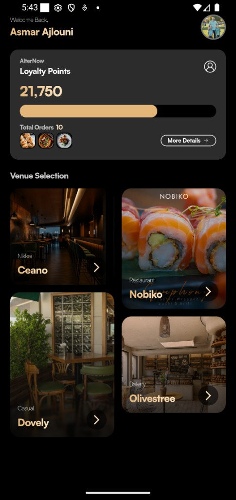
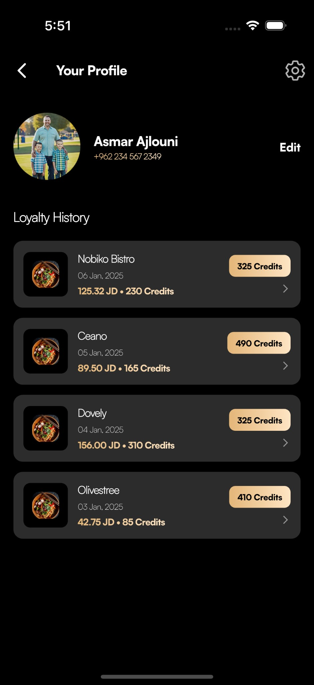

# Recast Designs Assessment

A Flutter mobile application showcasing a loyalty program experience with venue selection and user profile management. Features a modern dark theme with gold accent colors.

## Screenshots

### Home Screen

The home screen displays a welcome message, loyalty points card with progress tracking, and a grid of venue/restaurant cards.

<p>
  
 
</p>

### Profile Screen

The profile screen shows user information (name, phone number) with an edit option, and a scrollable loyalty history list with transaction details and credit badges.

<p>
  

</p>

## Features

- **Welcome & Profile Widget** — Personalized greeting with user name and avatar
- **Loyalty Points Card** — Displays brand loyalty status, points total, progress bar, total orders, and reward previews
- **Venue Selection** — Staggered grid of restaurant/venue cards with images and categories
- **Profile Page** — User info with edit option, loyalty history with transaction details per venue
- **Loyalty History Cards** — Individual transaction entries with date, amount, credits earned, and total credits per restaurant

## Tech Stack

- **Flutter** — Cross-platform UI framework
- **GetX** — State management and routing
- **flutter_screenutil** — Responsive sizing
- **flutter_staggered_grid_view** — Staggered grid layout for venue cards
- **intl** — Number and date formatting

## Project Structure

```
lib/
├── core/           # Theme, constants, colors, sizes
├── data/mock/      # Mock data for development
├── features/
│   ├── home/       # Home page, controller, bindings
│   └── profile/    # Profile page, controller, bindings
├── models/         # User, Restaurant, Loyalty models
└── widgets/        # Reusable UI components
```

## Getting Started

### Prerequisites

- Flutter SDK (^3.9.2)
- Dart SDK (^3.9.2)

### Installation

1. Clone the repository:
   ```bash
   git clone https://github.com/your-username/recast_designs_assessment.git
   cd recast_designs_assessment
   ```

2. Install dependencies:
   ```bash
   flutter pub get
   ```

3. Run the app:
   ```bash
   flutter run
   ```

### Running Tests

```bash
flutter test
```

## Design

- **Theme:** Dark mode with black/dark grey backgrounds
- **Accent:** Gold/sand (#D4A574) for highlights and CTAs
- **Typography:** Satoshi font family
- **Layout:** Design size 375×812 for ScreenUtil responsiveness

## License

This project is for assessment purposes.
